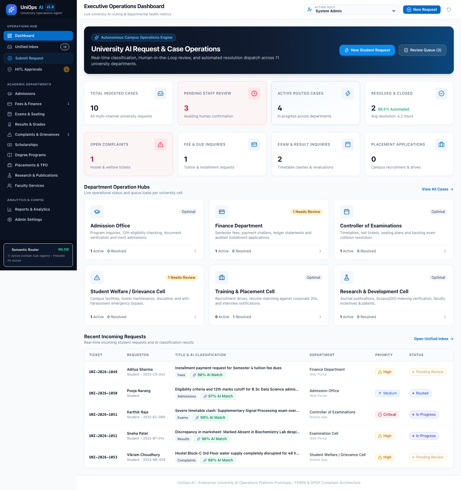
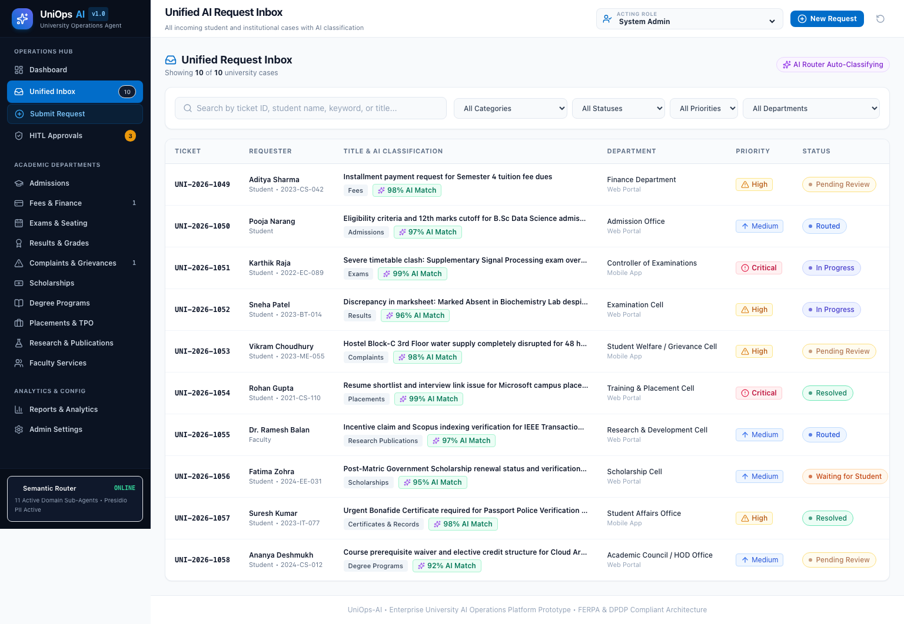
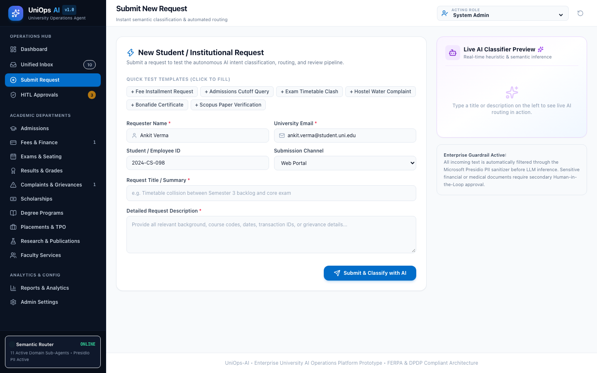
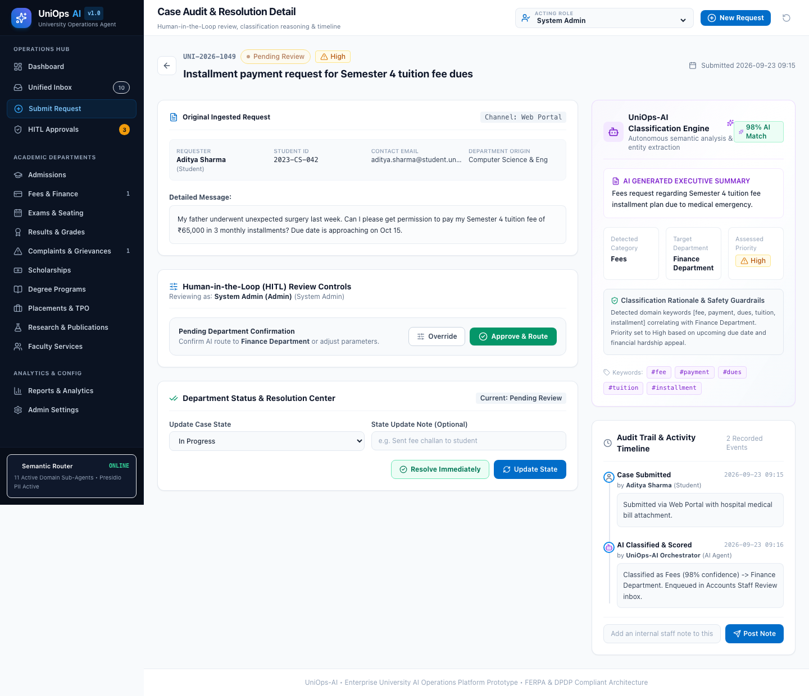

# UniOps-AI: University AI Operations Platform
### Multi-Agent Autonomous Higher Education Operating System

---

## 🎓 Overview

**UniOps-AI** is a comprehensive enterprise web application and multi-agent operations platform for modern universities. It orchestrates student lifecycle requests, fee workflows, exam timetables, grade disputes, grievance redressals, corporate placements, scholarship matching, and research publications under a central **Semantic Orchestrator** with **Human-in-the-Loop (HITL)** governance and statutory DPDP/FERPA compliance.

---

## 📸 Platform Screenshots Preview

| Executive Operations Dashboard | Unified Request Inbox |
| :---: | :---: |
|  |  |

| Live AI Request Classifier | Case Audit & HITL Resolution |
| :---: | :---: |
|  |  |

*👉 View the full screenshot gallery in [docs/07-visual-walkthrough.md](docs/07-visual-walkthrough.md).*

---

## ⚡ Quick Start (Local Run)

The application runs locally with zero backend configuration needed for the prototype.

```bash
# 1. Install dependencies
npm install

# 2. Start Vite local development server
npm run dev
```

Open your browser at **`http://localhost:5173`**.

To create a production build:
```bash
npm run build
npm run preview
```

---

## 🏛️ System Capabilities & Core Modules

| Module / Page | Purpose & AI Capabilities |
| :--- | :--- |
| **1. Executive Dashboard** | Live operational KPI telemetry, automation rates, open complaint alerts, and departmental queue health. |
| **2. AI Request Classifier & Unified Inbox** | Multi-channel request ingestion, real-time semantic categorization, confidence scoring, and multi-parameter filtering. |
| **3. Submit Request Portal** | Interactive request submission with **Live Real-time AI Classification Preview** and 6 instant test presets. |
| **4. Case Audit & Detail View** | Original message inspection, AI generated summary and rationale, confidence badges, and audit timeline. |
| **5. HITL Review & Override Desk** | HR-style staff confirmation: 1-click "Approve & Route" or manual category/department/priority overrides with justification notes. |
| **6. Admissions Office** | 12th marks eligibility cutoff checking, prospectus FAQs, and high school certificate OCR verification. |
| **7. Fees & Finance** | Semester dues, payment links, and audited CFO financial hardship installment plan applications. |
| **8. Controller of Examinations (COE)** | Timetables, hall tickets (75% attendance audit), and supplementary paper collision resolution. |
| **9. Examination Cell (Results)** | SGPA/CGPA trajectory calculations, transcript generation, and formal revaluation disputes. |
| **10. Complaints & Grievance Cell** | Multi-tier grievance routing (P1 Critical to P4 Routine) with **Zero-Delay Crisis Safety Bypass**. |
| **11. Scholarship & Financial Aid** | Automated matching against 50+ national (NSP) and merit schemes with document checklists. |
| **12. Degree Programs & Curriculum** | Semantic syllabus explorer, elective locks, and graduation credit requirement audits. |
| **13. Training & Placement Cell (TPO)** | Corporate recruitment drives, resume-to-JD semantic skill matching, and interview calendar alerts. |
| **14. Research & Development (R&D)** | Crossref / Scopus DOI publication verification, faculty research incentives, and patent tracking. |
| **15. Faculty & Staff Services** | Workload allotments, annual appraisal submissions, and invigilation schedules. |
| **16. Intelligence & SLA Reports** | Request volume distribution, turnaround benchmarks (4.2h avg), and SLA compliance ratings. |
| **17. Platform Admin Settings** | Confidence threshold adjustments, Presidio PII sanitizer toggles, and model cluster status. |

---

## 👥 Built-in User Role Switcher

Use the **Acting Role** dropdown in the top-right header to test the platform as:
- **Student / Parent**
- **Faculty**
- **Admission Officer**
- **Finance Officer (CFO)**
- **Controller of Examinations (COE)**
- **Scholarship Officer**
- **Placement Officer (TPO)**
- **Research Cell Officer**
- **HOD / Dean**
- **Registrar**
- **Vice Chancellor / University Management**
- **System Admin**

---

## 🤖 Rule-Based AI Classification Logic

The classifier evaluates semantic keywords and urgency indicators:
- **Fees:** `fee`, `payment`, `receipt`, `dues`, `tuition`, `installment`, `fine`, `refund`, `ledger`
- **Exams:** `exam`, `hall ticket`, `admit card`, `timetable`, `schedule`, `center`, `seating`, `clash`
- **Results:** `result`, `marksheet`, `grade`, `revaluation`, `sgpa`, `cgpa`, `transcript`, `discrepancy`
- **Admissions:** `admission`, `eligibility`, `application`, `cutoff`, `prospectus`, `12th marks`, `quota`
- **Complaints:** `complaint`, `harassment`, `hostel`, `facility`, `ragging`, `misconduct`, `warden`, `mess`
- **Scholarships:** `scholarship`, `financial aid`, `stipend`, `grant`, `nsp`, `post matric`
- **Placements:** `placement`, `company`, `interview`, `offer`, `resume`, `package`, `drive`, `tpo`
- **Research:** `paper`, `publication`, `journal`, `conference`, `doi`, `scopus`, `citation`, `patent`
- **Degree Programs:** `syllabus`, `credits`, `prerequisite`, `curriculum`, `elective`, `branch change`
- **Certificates & Records:** `bonafide`, `transfer certificate`, `migration`, `id card`, `provisional`

---

## 🛠️ Architecture Documentation & Specifications

- [Project Business Requirements (SRS)](project-requirement.md)
- [High-Level Design (HLD) & C4 Blueprint](high-level-design.md)
- [Low-Level Design (LLD) & Data Models](low-level-design.md)
- [Role Charters & Governance Model](docs/01-role-charters.md)
- [Agent Specifications Catalog](docs/02-agent-specifications.md)
- [Prompt Engineering Playbook](docs/03-prompt-playbook.md)
- [90-Day Implementation Roadmap](docs/04-roadmap-90days.md)
- [Statutory Governance & DPDP Compliance](docs/05-governance-framework.md)
- [Deployment & Observability Guide](docs/06-deployment-guide.md)
- [Visual Walkthrough & Screenshot Gallery](docs/07-visual-walkthrough.md)