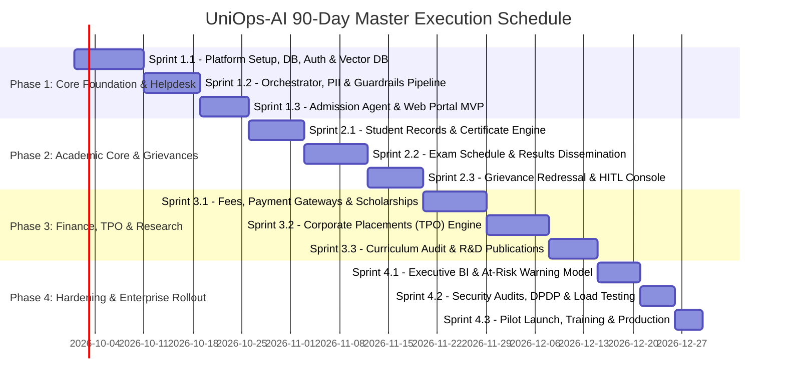

# 90-Day Implementation & Delivery Roadmap
## University AI Operations Platform (UniOps-AI)

---

### Executive Overview
This roadmap delineates the comprehensive, sprint-by-sprint execution schedule for architecting, developing, hardening, and deploying the **University AI Operations Platform (UniOps-AI)** over a strict 90-day timeline.

---

## 1. Master Timeline & Milestone Overview

---

## 2. Sprint-by-Sprint Work Breakdown Structure (WBS)

### Phase 1: Foundation, Semantic Orchestrator & Front-Door Helpdesk (Days 1–25)

#### Sprint 1.1: Platform Setup, Relational Schemas, Auth & Vector Index (Days 1–10)
- **Tasks:**
  1. Initialize production monorepo structure with Docker Compose dev environments.
  2. Implement PostgreSQL database schema migrations using Alembic (`users`, `conversations`, `messages`, `audit_logs`).
  3. Deploy Qdrant vector database and build ingestion script for university prospectus and bylaws.
  4. Implement JWT authentication with role claims (`STUDENT`, `STAFF`, `FACULTY`, `ADMIN`).
- **Deliverables:** Working backend container, initialized database, seeded vector store.
- **Exit Gate:** 100% test pass rate for authentication and document ingestion pipelines.

#### Sprint 1.2: Orchestrator, PII Sanitization & Guardrail Pipeline (Days 11–18)
- **Tasks:**
  1. Build LangGraph state graph with 11-intent zero-shot router.
  2. Integrate Microsoft Presidio for automated PII masking on incoming prompts.
  3. Implement Redis session state manager for multi-turn conversation memory.
  4. Configure NeMo Guardrails to defend against prompt injection and role-hijacking.
- **Deliverables:** Functional Orchestrator API endpoint (`POST /api/v1/chat/route`).
- **Exit Gate:** Intent classification accuracy $\ge 95\%$ on benchmark test suite of 200 queries.

#### Sprint 1.3: Admission Agent & Web Portal MVP (Days 19–25)
- **Tasks:**
  1. Build Admission Agent: Program search, eligibility rules engine, OCR marksheet parser.
  2. Build Angular frontend MVP: Responsive layout, streaming WebSocket chat UI, application tracker.
  3. Deploy staging environment on cloud/on-prem infrastructure.
- **Deliverables:** Live Admission AI Helpdesk prototype.
- **Exit Gate:** 80% automated resolution rate on mock prospective student inquiries.

---

### Phase 2: Academic Core, Examinations & Grievance Workflows (Days 26–50)

#### Sprint 2.1: Student Records & Digital Certificate Engine (Days 26–33)
- **Tasks:**
  1. Build Student Lifecycle Agent for profile lookups and attendance queries.
  2. Implement ReportLab / WeasyPrint PDF generator for digitally signed Bonafide Certificates with QR codes.
  3. Expose certificate generation API and integrate into Student Dashboard.
- **Deliverables:** Instant Bonafide & Enrollment Certificate generation service.
- **Exit Gate:** Certificate generation turnaround $< 30$ seconds.

#### Sprint 2.2: Exam Timetables, Results & LMS Integration (Days 34–42)
- **Tasks:**
  1. Implement Exam Schedule Agent: Clash detection, hall ticket verification, room allocation.
  2. Implement Results Agent: Marksheet breakdown, CGPA trajectory calculator, re-evaluation request flow.
  3. Connect mock/live SIS grade database.
- **Deliverables:** Exam & Results self-service modules.
- **Exit Gate:** 95% accuracy in exam schedule and grade retrieval across sample student database.

#### Sprint 2.3: Grievance Redressal & Departmental Staff HITL Console (Days 43–50)
- **Tasks:**
  1. Build Grievance Agent with P1–P4 severity classification and distress detection.
  2. Build Staff Review Portal: Departmental inboxes (COE, Admissions, Finance, Student Welfare).
  3. Implement SLA escalation timer jobs using Celery & Redis.
- **Deliverables:** End-to-end Grievance Redressal and Staff Approval UI.
- **Exit Gate:** Successful emergency bypass test routing P1 alerts to Proctor SMS/Email in $< 15$ seconds.

---

### Phase 3: Financial Operations, Placements & Research Intelligence (Days 51–75)

#### Sprint 3.1: Fees, Payment Gateways & Scholarship Matcher (Days 51–59)
- **Tasks:**
  1. Implement Fees Agent: Ledger statements, outstanding balances, installment plan request pipeline.
  2. Integrate Payment Gateway (Razorpay/Stripe) webhook listeners.
  3. Build Scholarship Agent: 50+ scheme matching algorithm based on student CGPA and income.
- **Deliverables:** Fee payment portal, audited installment review flow, scholarship recommender.
- **Exit Gate:** Zero discrepancy in financial balance calculations across 500 test accounts.

#### Sprint 3.2: Corporate Placement (TPO) Ecosystem (Days 60–68)
- **Tasks:**
  1. Build Placement Agent: Drive announcements, resume PDF skill extraction, JD semantic matching.
  2. Automated candidate shortlisting and interview slot scheduling.
  3. TPO administrative dashboard for drive monitoring and offer tracking.
- **Deliverables:** TPO candidate-matching and interview management module.
- **Exit Gate:** 60% reduction in manual screening time for mock recruitment drive of 200 applicants.

#### Sprint 3.3: Curriculum Audit & Research Publication Engine (Days 69–75)
- **Tasks:**
  1. Implement Degree Program Agent: Semantic syllabus search, credit audit calculator.
  2. Implement Research Agent: Crossref/Scopus DOI verification API, faculty publication metrics.
- **Deliverables:** Syllabus explorer, graduation credit auditor, R&D publication tracker.
- **Exit Gate:** Accurate validation of 100 sample DOI references with indexing metadata.

---

### Phase 4: Management Intelligence, Hardening & Campus Rollout (Days 76–90)

#### Sprint 4.1: Executive Management Intelligence & Risk Analytics (Days 76–81)
- **Tasks:**
  1. Build Management Intelligence Agent: Natural language SQL generation over operational data.
  2. Implement At-Risk Student Predictive Model (attendance shortage + low internal marks).
  3. Executive dashboards for Chancellor, VC, and Registrar.
- **Deliverables:** Executive BI Portal & Dropout Early Warning System.

#### Sprint 4.2: Security Audits, DPDP Compliance & Load Testing (Days 82–86)
- **Tasks:**
  1. OWASP Top 10 for LLM security audit (jailbreak tests, prompt injection defenses).
  2. DPDP Act / FERPA compliance audit: Right to be forgotten, data anonymization verification.
  3. Stress & load testing: 5,000 concurrent WebSocket sessions and 500 RPS API traffic.
- **Deliverables:** Security certification report and load testing benchmark logs.
- **Exit Gate:** System p99 latency $< 2.5$ seconds under maximum concurrent load; zero PII leaks.

#### Sprint 4.3: Staff Training, Pilot Launch & Production Cutover (Days 87–90)
- **Tasks:**
  1. Conduct hands-on training workshops for Admissions, Academics, Finance, and TPO staff.
  2. Pilot launch across 2 flagship departments (e.g., Computer Science & Business Administration).
  3. Final production DNS switch, SSL certification, and 24/7 hypercare monitoring activation.
- **Deliverables:** Production platform live across university campus.
- **Exit Gate:** Formal institutional sign-off from Registrar and CTO.
