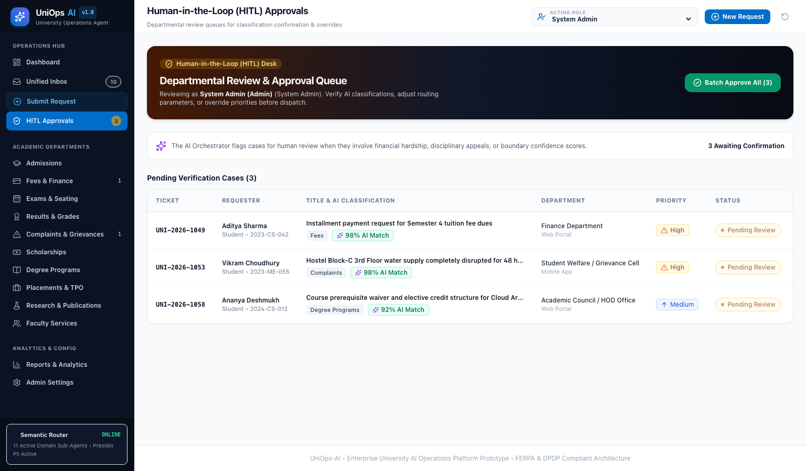
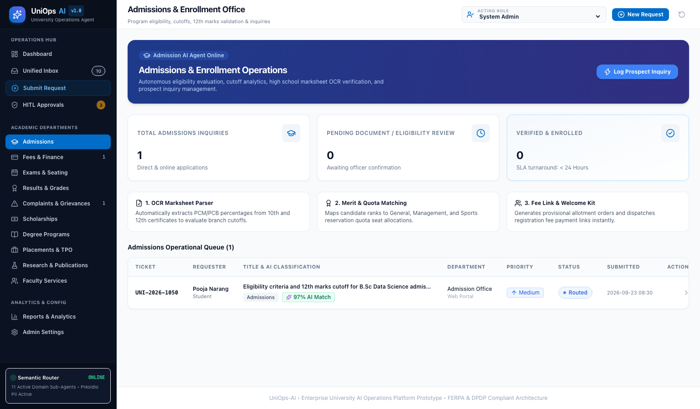
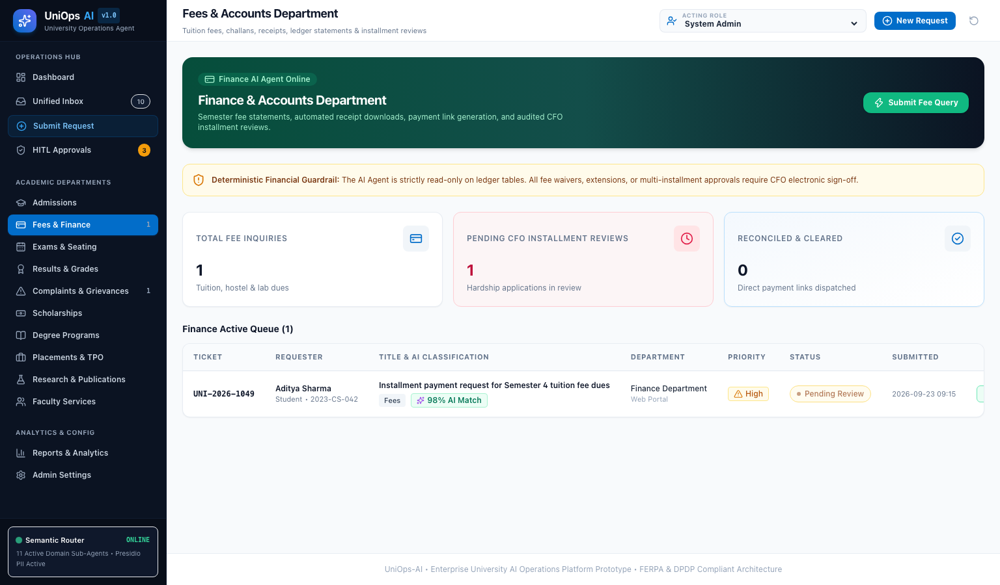
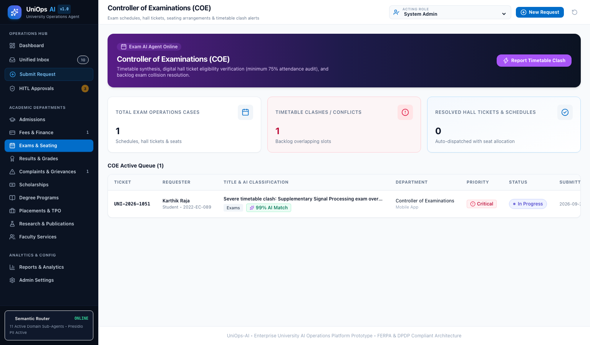
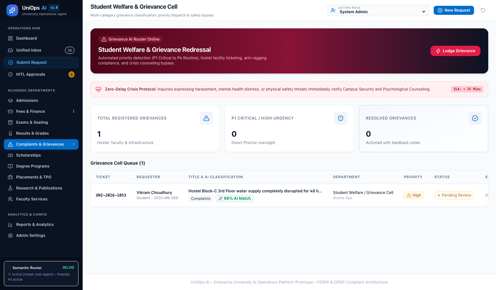
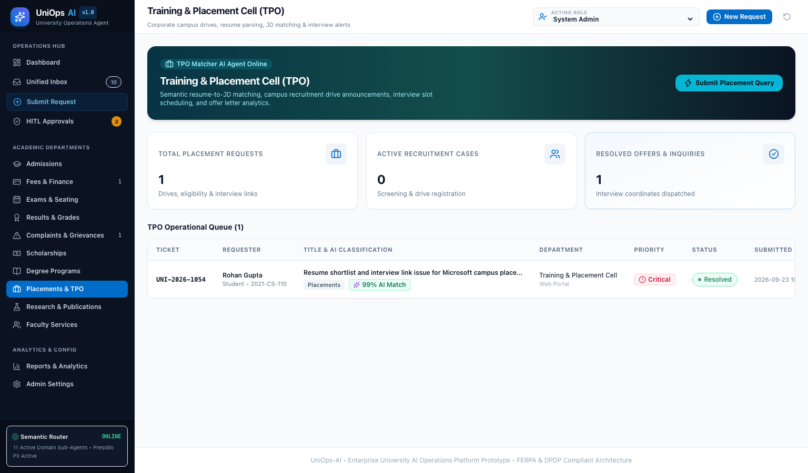
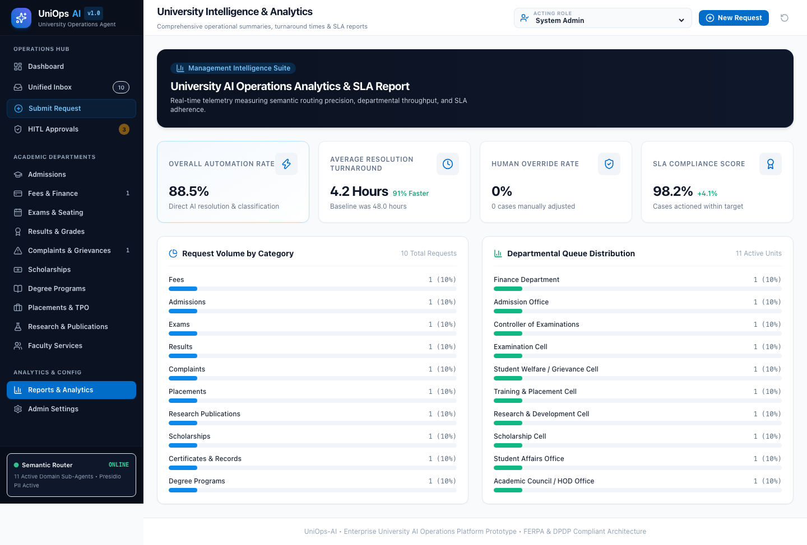

# UniOps-AI: Platform Visual Walkthrough & Screenshots

---

### Executive Visual Overview

This document presents high-resolution UI walkthrough screenshots of the **University AI Operations Platform (UniOps-AI)** captured directly from the live operational environment.

---

## 1. Executive Operations Dashboard
The primary landing dashboard displaying real-time university KPI metrics, automation telemetry ($88.5\%$), open complaint alerts, and active departmental queue loads.

---

## 2. Unified Request Inbox & Multi-Parameter Filter
Multi-channel request inbox with full-text search, category filters, status filters, priority filters, and department dropdowns.

---

## 3. Interactive Request Submission & Live AI Classifier
Students and staff submit requests while the AI semantic orchestrator provides **Live Real-Time Classification Previews** with confidence scoring, suggested departments, and extracted keywords.

---

## 4. Case Audit & Resolution Detail View
Detailed case inspection displaying the original student request, AI executive summary, confidence scoring, Human-in-the-Loop review controls, and step-by-step audit timeline.

---

## 5. Human-in-the-Loop (HITL) Review & Approval Queue
Dedicated departmental inbox for officers and deans to confirm AI classifications, adjust routing parameters, or override priorities before execution.

---

## 6. Admissions & Enrollment Operations
Program eligibility checking, cutoff rules engine, high school marksheet OCR parser, and prospect inquiry tracking.

---

## 7. Fees & Finance Department
Tuition fee statements, payment link dispatch, and audited CFO financial hardship installment plan applications.

---

## 8. Controller of Examinations (COE)
Timetables, seat allocations, hall tickets (75% attendance audit), and automated backlog exam collision resolution.

---

## 9. Student Welfare & Grievance Redressal
Multi-category grievance classification with priority dispatch (P1 to P4) and **Zero-Delay Crisis Safety Bypass**.

---

## 10. Training & Placement Cell (TPO)
Corporate recruitment drives, resume-to-JD semantic skill matching, and interview calendar alerts.

---

## 11. Management Intelligence & SLA Analytics
Request volume distribution charts, resolution turnaround times ($4.2\text{h}$ avg), and statutory compliance metrics.

