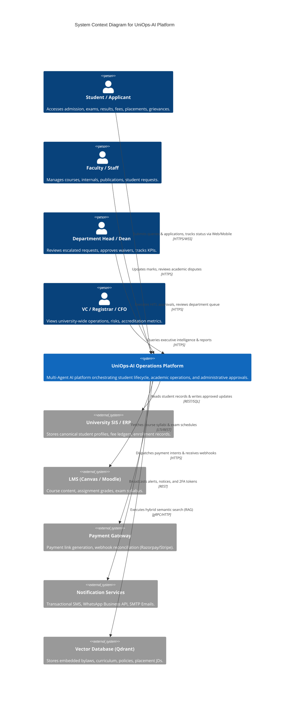
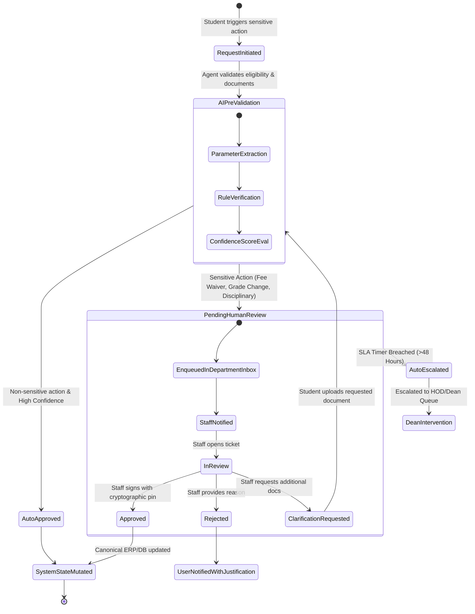

# University AI Operations Platform (UniOps-AI)
## High-Level Design (HLD) Specification — AI SDLC Standards

---

### Document Control
- **Document Version:** 1.0.0
- **Standard:** AI SDLC (AI Software Development Life Cycle) Framework
- **Project Name:** University AI Operations Platform (UniOps-AI)
- **Author:** Senior AI Solutions Architect & Enterprise Systems Specialist
- **Status:** Approved for Low-Level Design & Implementation

---

## 1. AI SDLC Framework Alignment

The development of the UniOps-AI platform follows a rigorous **AI Software Development Life Cycle (AI SDLC)** framework tailored for enterprise multi-agent platforms:

```
┌─────────────────┐     ┌─────────────────┐     ┌─────────────────┐     ┌─────────────────┐
│ 1. Business &   │ ──> │ 2. Data & Model │ ──> │ 3. Architecture │ ──> │ 4. Multi-Agent  │
│ Requirement Eng.│     │ Strategy & Gov. │     │ & Guardrails HLD│     │ & HITL Dev (LLD)│
└─────────────────┘     └─────────────────┘     └─────────────────┘     └────────┬────────┘
                                                                                 │
┌─────────────────┐     ┌─────────────────┐     ┌─────────────────┐              │
│ 7. Continual    │ <── │ 6. Deployment & │ <── │ 5. Verification,│ <────────────┘
│ Learning & Eval │     │ Production Ops  │     │ Red-Teaming & QA│
└─────────────────┘     └─────────────────┘     └─────────────────┘
```

1. **Requirements & Scope Engineering:** Completed in `project-requirement.md` (Role charters, capability matrix, 90-day roadmap).
2. **Data & Knowledge Base Strategy:** Document parsing, vector embedding pipelines, PII scrubbing, hybrid search architectures.
3. **High-Level Design (This Document):** System topology, orchestrator patterns, safety guardrails, integration layer, and infrastructure.
4. **Low-Level Design (`low-level-design.md`):** StateGraph definitions, tool signatures, database schemas, API contracts, and execution sequences.
5. **Red-Teaming & AI Safety Verification:** Adversarial evaluation, jailbreak resistance, hallucination benchmarks, and DPDP compliance.
6. **Production Deployment & Monitoring:** Containerized Kubernetes/Docker rollout, WebSocket streaming, distributed tracing (OpenTelemetry/LangSmith).
7. **Continuous Feedback & Model Governance:** Ground-truth human feedback loops, LLM-as-a-judge automated regression evaluations.

---

## 2. System Context & C4 Architecture Blueprint

### 2.1 C4 Level 1: System Context Diagram



---

### 2.2 C4 Level 2: Container Diagram

```mermaid
graph TB
    subgraph Client Tier
        SPA[Angular 18+ Web Application<br/>TailwindCSS, RxJS, WebSocket Client]
        MobileWeb[Mobile Responsive PWA]
    end

    subgraph Edge & Security Tier
        Cloudflare[Cloudflare WAF & DDoS Protection]
        ReverseProxy[Nginx Ingress / Reverse Proxy]
    end

    subgraph Application & Gateway Tier
        FastAPIGW[FastAPI Core Gateway<br/>Asynchronous API, JWT Auth, Presidio PII Masker]
        WSManager[WebSocket Connection & Token Streaming Manager]
    end

    subgraph Agentic Orchestration Tier
        MasterOrch[Master Semantic Orchestrator<br/>LangGraph StateMachine & Intent Router]
        PolicyEngine[Deterministic Policy & Guardrails Engine<br/>NeMo Guardrails + Output Verifiers]
        
        subgraph Specialized Domain Agents
            A1[Admission Agent]
            A2[Student Records Agent]
            A3[Fees & Finance Agent]
            A4[Exam Schedule Agent]
            A5[Results & Grades Agent]
            A6[Grievance Agent]
            A7[Scholarship Agent]
            A8[Curriculum Agent]
            A9[Placement Agent]
            A10[R&D Publication Agent]
            A11[Management Intel Agent]
        end
    end

    subgraph Storage & Cache Tier
        Postgres[(PostgreSQL 16 Primary DB<br/>Users, Tickets, Approvals, Audit Logs)]
        RedisCache[(Redis 7.2 Cache & Broker<br/>Sessions, Rate Limiting, Celery Queue)]
        Qdrant[(Qdrant Vector Database<br/>Hybrid Dense/Sparse Document Embeddings)]
        MinIO[(MinIO / S3 Object Storage<br/>Mark sheets, Resumes, Generated Certificates)]
    end

    subgraph External LLM & Model Inference Cluster
        PrimaryLLM[Primary LLM API<br/>OpenAI GPT-4o / Claude 3.5 Sonnet]
        FallbackLLM[Fallback LLM API<br/>Google Gemini 1.5 Pro / Flash]
        LocalLLM[Self-Hosted LLM Cluster<br/>Ollama / vLLM Llama 3.3 70B On-Prem]
    end

    Client Tier --> Cloudflare
    Cloudflare --> ReverseProxy
    ReverseProxy --> FastAPIGW
    ReverseProxy --> WSManager

    FastAPIGW --> MasterOrch
    WSManager --> MasterOrch
    MasterOrch --> PolicyEngine
    PolicyEngine --> A1 & A2 & A3 & A4 & A5 & A6 & A7 & A8 & A9 & A10 & A11

    A1 & A2 & A3 & A4 & A5 & A6 & A7 & A8 & A9 & A10 & A11 --> Postgres
    A1 & A2 & A3 & A4 & A5 & A6 & A7 & A8 & A9 & A10 & A11 --> RedisCache
    A1 & A2 & A3 & A4 & A5 & A6 & A7 & A8 & A9 & A10 & A11 --> Qdrant
    A1 & A2 & A3 & A4 & A5 & A6 & A7 & A8 & A9 & A10 & A11 --> MinIO

    MasterOrch --> PrimaryLLM
    PrimaryLLM -. Failover .-> FallbackLLM
    FallbackLLM -. Failover .-> LocalLLM
```

---

## 3. Multi-Agent Orchestration & Network Topology

### 3.1 Supervisor-Worker Dynamic Graph Pattern
The platform implements a **Supervisor-Worker State Graph** using LangGraph. The Supervisor does not execute tools directly; it classifies intent, evaluates conversation state, maintains multi-turn context, and delegates task execution to domain agents.

```
                               ┌──────────────────────────┐
                               │   User Message Ingest    │
                               └────────────┬─────────────┘
                                            │
                               ┌────────────▼─────────────┐
                               │  PII Redaction & Safety  │
                               └────────────┬─────────────┘
                                            │
                               ┌────────────▼─────────────┐
                               │ Master Supervisor Agent  │
                               │ (Intent Classification)  │
                               └────────────┬─────────────┘
                                            │
         ┌───────────────────┬──────────────┼───────────────────┬───────────────────┐
         ▼                   ▼              ▼                   ▼                   ▼
  ┌──────────────┐   ┌──────────────┐ ┌──────────────┐   ┌──────────────┐   ┌──────────────┐
  │  Admission   │   │  Academics   │ │   Finance    │   │  Placements  │   │  Grievance   │
  │    Worker    │   │    Worker    │ │    Worker    │   │    Worker    │   │    Worker    │
  └──────┬───────┘   └──────┬───────┘ └──────┬───────┘   └──────┬───────┘   └──────┬───────┘
         │                  │               │                   │                  │
         └───────────────────┴──────────────┼───────────────────┴──────────────────┘
                                            │
                               ┌────────────▼─────────────┐
                               │ Guardrails & Hallucination│
                               │     Output Verifier      │
                               └────────────┬─────────────┘
                                            │
                     ┌──────────────────────┴──────────────────────┐
                     │ Confidence >= 0.85                          │ Confidence < 0.85
                     ▼                                             ▼
        ┌──────────────────────────┐                  ┌──────────────────────────┐
        │ Stream Response to User  │                  │ Route to Human Desk      │
        │  & Log Audit Metadata    │                  │ (HITL Ticket Created)    │
        └──────────────────────────┘                  └──────────────────────────┘
```

---

## 4. RAG (Retrieval-Augmented Generation) Architecture

### 4.1 Hybrid Retrieval Pipeline
To eliminate hallucination regarding university bylaws, eligibility percentages, course prerequisites, and fee policies, UniOps-AI utilizes a **Hybrid Multi-Stage Retrieval Engine**:

```
 ┌──────────────────────┐
 │  Raw Policy Docs,    │
 │ Syllabi, Prospectus  │
 └──────────┬───────────┘
            │
 ┌──────────▼───────────┐
 │ Hierarchical Chunker │  (Parent-Child Chunking: 1024-token parent, 256-token child chunks)
 └──────────┬───────────┘
            │
      ┌─────┴─────────────────────────┐
      ▼                               ▼
┌─────────────────────────┐     ┌─────────────────────────┐
│ Dense Semantic Vector   │     │ Sparse Lexical Index    │
│ (text-embedding-3-large)│     │ (BM25 Token Inverted)   │
└─────────────┬───────────┘     └─────────────┬───────────┘
              │                               │
              └───────────────┬───────────────┘
                              ▼
                ┌───────────────────────────┐
                │ Reciprocal Rank Fusion    │  (Combines Dense & Sparse retrieval scores)
                └─────────────┬─────────────┘
                              ▼
                ┌───────────────────────────┐
                │ Cross-Encoder Re-Ranker   │  (FlashRank / Cohere Re-ranker Top-K=5)
                └─────────────┬─────────────┘
                              ▼
                ┌───────────────────────────┐
                │ Prompt Context Injection  │
                └───────────────────────────┘
```

---

## 5. Human-in-the-Loop (HITL) Subsystem Architecture

### 5.1 State Machine for Sensitive Operations
Any agent operation that alters student financial state, official transcripts, disciplinary records, or admission confirmations must traverse the **HITL State Engine**:



---

## 6. Security, Trust, Safety & Compliance Architecture

### 6.1 Defense-in-Depth Guardrail Stack

```
Layer 1: Network & Ingress WAF
 └── Cloudflare DDoS filtering + IP rate limiting (100 req/min per IP)

Layer 2: Ingestion & PII Masking
 └── Microsoft Presidio Analyzer + Anonymizer (Masks Aadhaar, PAN, SSN, Credit Cards, Phone #s)

Layer 3: Prompt Injection & Jailbreak Defense
 └── NeMo Guardrails Input Scanner (Blocks system prompt exfiltration & role-hijacking)

Layer 4: Access Control & Authorization
 └── Role-Based Access Control (RBAC) + Attribute-Based Access Control (ABAC) verified at API Gateway

Layer 5: Tool & Execution Isolation
 └── Read-only DB connection pools for exploratory agent queries; isolated transactions for mutations

Layer 6: Hallucination & Factuality Output Guardrail
 └── SelfCheckGPT & Grounding Verification against retrieved RAG chunks

Layer 7: Cryptographic Audit Logging
 └── Immutable audit ledger recording [Timestamp, UserID, AgentID, QueryHash, ResponseHash, ApprovedBy]
```

---

## 7. Non-Functional Architecture & Quality Attributes

| Quality Attribute | Architectural Strategy | Quantitative Target |
| :--- | :--- | :--- |
| **Latency (Token Streaming)** | Asynchronous WebSocket streaming with Redis message broker | First chunk `< 800ms`, full generation `< 2.5s` |
| **Availability & Fault Tolerance** | Redundant stateless microservices behind Nginx; multi-tier LLM failover cluster | **99.9% Uptime** (Max 43 min downtime/month) |
| **Scalability & Concurrency** | Non-blocking Async I/O (FastAPI/Uvicorn), horizontal pod autoscaling (HPA) | **5,000 Concurrent WebSockets**, 500 RPS API |
| **Data Privacy & Compliance** | Zero data-retention agreements with LLM providers; AES-256 at rest, TLS 1.3 in transit | **100% DPDP Act (2023) & FERPA Compliant** |
| **Model Disaster Recovery** | Automatic dynamic fallover to on-prem self-hosted Llama 3.3 70B cluster if cloud APIs fail | Failover trigger in `< 3.0 seconds` |

---

## 8. AI Observability, Evaluation & Telemetry

### 8.1 Continuous Evaluation Matrix (LLM-as-a-Judge)
The platform logs all interactions asynchronously to an evaluation cluster where a judge model assesses:
1. **Faithfulness / Groundedness:** Does the output contain claims not present in the RAG context? (Target: `> 0.98`)
2. **Answer Relevance:** Does the response address the user's specific departmental query? (Target: `> 0.95`)
3. **Routing Precision:** Did the Orchestrator route to the correct specialized domain agent? (Target: `> 0.96`)
4. **Latency & Token Efficiency:** Average cost per student interaction tracked in real time.
