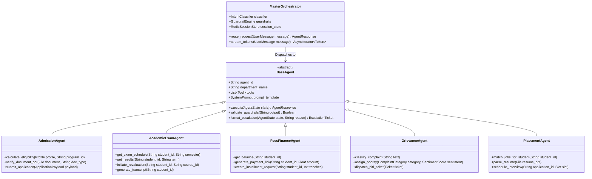
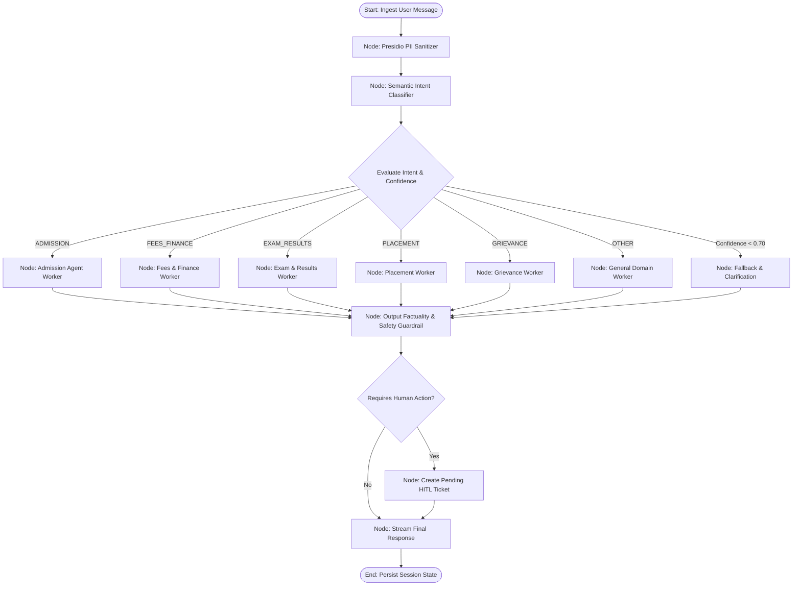
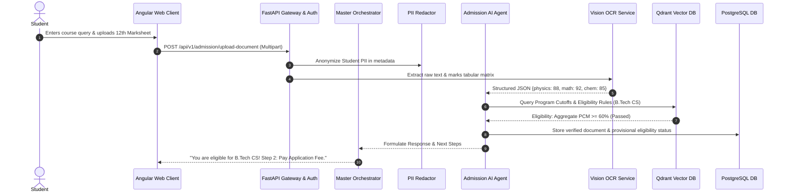
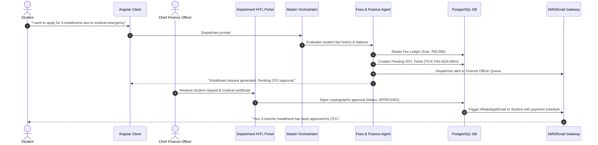

# University AI Operations Platform (UniOps-AI)
## Low-Level Design (LLD) Specification — AI SDLC Standards

---

### Document Control
- **Document Version:** 1.0.0
- **Standard:** AI SDLC (AI Software Development Life Cycle) Framework
- **Project Name:** University AI Operations Platform (UniOps-AI)
- **Author:** Senior AI Solutions Architect & Enterprise Systems Specialist
- **Status:** Approved for Implementation

---

## 1. Class & Component Architecture

### 1.1 Object-Oriented Agent Class Hierarchy



---

## 2. LangGraph State Machine & Orchestrator Graph Definition

### 2.1 State TypedDict Definition

```python
from typing import TypedDict, List, Dict, Any, Optional
from enum import Enum

class IntentCategory(str, Enum):
    ADMISSION = "ADMISSION"
    STUDENT_RECORDS = "STUDENT_RECORDS"
    FEES_FINANCE = "FEES_FINANCE"
    EXAM_SCHEDULE = "EXAM_SCHEDULE"
    RESULTS_GRADES = "RESULTS_GRADES"
    GRIEVANCE = "GRIEVANCE"
    SCHOLARSHIP = "SCHOLARSHIP"
    CURRICULUM = "CURRICULUM"
    PLACEMENT = "PLACEMENT"
    RESEARCH = "RESEARCH"
    MANAGEMENT_INTEL = "MANAGEMENT_INTEL"
    GENERAL_QUERY = "GENERAL_QUERY"

class UserRole(str, Enum):
    STUDENT = "STUDENT"
    PARENT = "PARENT"
    FACULTY = "FACULTY"
    STAFF = "STAFF"
    DEAN = "DEAN"
    ADMIN = "ADMIN"

class AgentState(TypedDict):
    conversation_id: str
    user_id: str
    user_role: UserRole
    messages: List[Dict[str, str]]
    current_intent: Optional[IntentCategory]
    intent_confidence: float
    extracted_entities: Dict[str, Any]
    retrieved_context: List[str]
    agent_response: Optional[str]
    requires_hitl: bool
    escalation_reason: Optional[str]
    ticket_id: Optional[str]
    error: Optional[str]
```

### 2.2 Orchestrator StateGraph Topology



---

## 3. Database Schemas (PostgreSQL & SQLAlchemy 2.0 DDL)

### 3.1 Core Relational Schema

```sql
-- Core Users Table
CREATE TABLE users (
    id UUID PRIMARY KEY DEFAULT gen_random_uuid(),
    university_id VARCHAR(64) UNIQUE NOT NULL,
    email VARCHAR(255) UNIQUE NOT NULL,
    hashed_password VARCHAR(255) NOT NULL,
    full_name VARCHAR(255) NOT NULL,
    role VARCHAR(32) NOT NULL CHECK (role IN ('STUDENT', 'PARENT', 'FACULTY', 'STAFF', 'DEAN', 'REGISTRAR', 'ADMIN')),
    department VARCHAR(128),
    is_active BOOLEAN DEFAULT TRUE,
    created_at TIMESTAMP WITH TIME ZONE DEFAULT CURRENT_TIMESTAMP,
    updated_at TIMESTAMP WITH TIME ZONE DEFAULT CURRENT_TIMESTAMP
);

-- Conversations & Multi-turn Session Management
CREATE TABLE conversations (
    id UUID PRIMARY KEY DEFAULT gen_random_uuid(),
    user_id UUID REFERENCES users(id) ON DELETE CASCADE,
    title VARCHAR(255),
    created_at TIMESTAMP WITH TIME ZONE DEFAULT CURRENT_TIMESTAMP,
    updated_at TIMESTAMP WITH TIME ZONE DEFAULT CURRENT_TIMESTAMP
);

CREATE TABLE messages (
    id UUID PRIMARY KEY DEFAULT gen_random_uuid(),
    conversation_id UUID REFERENCES conversations(id) ON DELETE CASCADE,
    sender_type VARCHAR(16) CHECK (sender_type IN ('USER', 'AGENT', 'SYSTEM')),
    content TEXT NOT NULL,
    agent_name VARCHAR(64),
    intent_detected VARCHAR(64),
    confidence_score NUMERIC(4, 3),
    rag_sources JSONB,
    created_at TIMESTAMP WITH TIME ZONE DEFAULT CURRENT_TIMESTAMP
);

-- Human-In-The-Loop (HITL) Department Tickets
CREATE TABLE department_tickets (
    id UUID PRIMARY KEY DEFAULT gen_random_uuid(),
    ticket_number VARCHAR(32) UNIQUE NOT NULL,
    student_id UUID REFERENCES users(id),
    department VARCHAR(64) NOT NULL,
    category VARCHAR(64) NOT NULL,
    priority VARCHAR(16) NOT NULL CHECK (priority IN ('P1_CRITICAL', 'P2_HIGH', 'P3_MEDIUM', 'P4_LOW')),
    status VARCHAR(32) NOT NULL DEFAULT 'PENDING_REVIEW' CHECK (status IN ('PENDING_REVIEW', 'IN_PROGRESS', 'APPROVED', 'REJECTED', 'AUTO_ESCALATED')),
    title VARCHAR(255) NOT NULL,
    description TEXT NOT NULL,
    ai_summary TEXT,
    assigned_staff_id UUID REFERENCES users(id),
    resolution_notes TEXT,
    sla_deadline TIMESTAMP WITH TIME ZONE NOT NULL,
    created_at TIMESTAMP WITH TIME ZONE DEFAULT CURRENT_TIMESTAMP,
    resolved_at TIMESTAMP WITH TIME ZONE
);

-- Immutable Cryptographic Audit Logs
CREATE TABLE audit_logs (
    id UUID PRIMARY KEY DEFAULT gen_random_uuid(),
    actor_id UUID REFERENCES users(id),
    action_type VARCHAR(64) NOT NULL,
    target_entity VARCHAR(64) NOT NULL,
    entity_id VARCHAR(128) NOT NULL,
    previous_state JSONB,
    new_state JSONB,
    ip_address VARCHAR(45),
    user_agent TEXT,
    hash_signature VARCHAR(255) NOT NULL,
    created_at TIMESTAMP WITH TIME ZONE DEFAULT CURRENT_TIMESTAMP
);

-- Academic & Examinations Tables
CREATE TABLE student_academic_records (
    id UUID PRIMARY KEY DEFAULT gen_random_uuid(),
    student_id UUID REFERENCES users(id) UNIQUE,
    program_id VARCHAR(64) NOT NULL,
    current_semester INT NOT NULL,
    cgpa NUMERIC(4, 2) NOT NULL,
    total_credits_earned INT NOT NULL,
    attendance_percentage NUMERIC(5, 2) NOT NULL,
    academic_standing VARCHAR(32) DEFAULT 'GOOD_STANDING'
);

CREATE TABLE exam_results (
    id UUID PRIMARY KEY DEFAULT gen_random_uuid(),
    student_id UUID REFERENCES users(id),
    course_code VARCHAR(32) NOT NULL,
    course_name VARCHAR(255) NOT NULL,
    semester INT NOT NULL,
    internal_marks NUMERIC(5, 2),
    midterm_marks NUMERIC(5, 2),
    endterm_marks NUMERIC(5, 2),
    total_marks NUMERIC(5, 2),
    grade VARCHAR(4),
    is_revaluation_requested BOOLEAN DEFAULT FALSE,
    created_at TIMESTAMP WITH TIME ZONE DEFAULT CURRENT_TIMESTAMP
);

-- Financial Ledgers
CREATE TABLE fee_ledgers (
    id UUID PRIMARY KEY DEFAULT gen_random_uuid(),
    student_id UUID REFERENCES users(id),
    academic_year VARCHAR(16) NOT NULL,
    semester INT NOT NULL,
    total_due NUMERIC(10, 2) NOT NULL,
    amount_paid NUMERIC(10, 2) NOT NULL DEFAULT 0.00,
    outstanding_balance NUMERIC(10, 2) NOT NULL,
    due_date DATE NOT NULL,
    is_installment_approved BOOLEAN DEFAULT FALSE,
    updated_at TIMESTAMP WITH TIME ZONE DEFAULT CURRENT_TIMESTAMP
);

-- Corporate Placement Records
CREATE TABLE placement_jobs (
    id UUID PRIMARY KEY DEFAULT gen_random_uuid(),
    company_name VARCHAR(255) NOT NULL,
    role_title VARCHAR(255) NOT NULL,
    ctc_range VARCHAR(64) NOT NULL,
    min_cgpa NUMERIC(4, 2) NOT NULL,
    eligible_departments JSONB NOT NULL,
    required_skills JSONB NOT NULL,
    deadline DATE NOT NULL,
    is_active BOOLEAN DEFAULT TRUE
);
```

---

## 4. RESTful API & WebSocket Contract Specifications

### 4.1 Real-Time Streaming Chat WebSocket Protocol

- **Endpoint:** `WSS /ws/v1/chat/{conversation_id}`
- **Authentication:** Bearer JWT in query param or initial connection handshake frame.

#### Client Request Frame:
```json
{
  "type": "USER_PROMPT",
  "payload": {
    "message": "Can I pay my semester 4 tuition fee in 3 installments?",
    "client_timestamp": "2026-10-01T10:15:30Z"
  }
}
```

#### Server Streaming Response Frames:
```json
// Frame 1: Intent & Routing Notification
{
  "type": "ROUTING_UPDATE",
  "payload": {
    "intent": "FEES_FINANCE",
    "agent_name": "Fees & Finance AI Agent",
    "confidence": 0.985
  }
}

// Frame 2..N: Token Stream Chunks
{
  "type": "TOKEN_CHUNK",
  "payload": {
    "delta": "Your outstanding balance for Semester 4 is ₹65,000. Under university policy..."
  }
}

// Final Frame: Actionable Outcome & HITL Status
{
  "type": "EXECUTION_COMPLETE",
  "payload": {
    "requires_hitl": true,
    "action_type": "INSTALLMENT_REQUEST_SUBMISSION",
    "ticket_id": "TICK-FIN-2026-8941",
    "status": "SUBMITTED_TO_CFO",
    "sources": ["University Fee Policy 2026, Section 4.2"],
    "action_payload": {
      "total_amount": 65000,
      "requested_tranches": 3,
      "installment_breakdown": [22000, 21500, 21500]
    }
  }
}
```

---

### 4.2 Core REST Endpoints

```
POST /api/v1/admission/eligibility-check
POST /api/v1/admission/upload-document
GET  /api/v1/academic/results/{student_id}
POST /api/v1/academic/revaluation-request
GET  /api/v1/finance/ledger/{student_id}
POST /api/v1/finance/installment-application
POST /api/v1/grievance/submit-ticket
GET  /api/v1/placement/matched-jobs/{student_id}
POST /api/v1/hitl/tickets/{ticket_id}/approve
POST /api/v1/hitl/tickets/{ticket_id}/reject
```

---

## 5. Sequence Execution Flows

### 5.1 Admission Application & Document OCR Verification Sequence



---

### 5.2 Fee Installment Waiver Workflow (Human-in-the-Loop)



---

## 6. Directory Structure & File Layout

```
university-management-ai-agent/
├── README.md
├── project-requirement.md
├── high-level-design.md
├── low-level-design.md
├── docker-compose.yml
├── .github/
│   └── workflows/
│       ├── ci-backend.yml
│       └── ci-frontend.yml
├── backend/
│   ├── app/
│   │   ├── main.py
│   │   ├── core/
│   │   │   ├── config.py
│   │   │   ├── security.py
│   │   │   ├── presidio_sanitizer.py
│   │   │   └── database.py
│   │   ├── agents/
│   │   │   ├── base_agent.py
│   │   │   ├── orchestrator.py
│   │   │   ├── admission_agent.py
│   │   │   ├── academic_agent.py
│   │   │   ├── fees_agent.py
│   │   │   ├── grievance_agent.py
│   │   │   ├── placement_agent.py
│   │   │   └── research_agent.py
│   │   ├── services/
│   │   │   ├── llm_service.py
│   │   │   ├── rag_service.py
│   │   │   ├── ocr_service.py
│   │   │   └── pdf_generator.py
│   │   ├── models/
│   │   │   ├── database_models.py
│   │   │   └── pydantic_schemas.py
│   │   ├── api/
│   │   │   ├── v1/
│   │   │   │   ├── auth.py
│   │   │   │   ├── chat_ws.py
│   │   │   │   ├── admission.py
│   │   │   │   ├── academic.py
│   │   │   │   ├── finance.py
│   │   │   │   ├── grievance.py
│   │   │   │   ├── placement.py
│   │   │   │   └── hitl_admin.py
│   ├── tests/
│   ├── requirements.txt
│   └── Dockerfile
├── frontend/
│   ├── src/
│   │   ├── app/
│   │   │   ├── core/
│   │   │   ├── shared/
│   │   │   ├── modules/
│   │   │   │   ├── student-portal/
│   │   │   │   ├── staff-hitl-inbox/
│   │   │   │   ├── executive-dashboard/
│   │   │   │   └── chat-stream/
│   │   │   ├── app.routes.ts
│   │   │   └── app.config.ts
│   ├── angular.json
│   ├── tailwind.config.js
│   ├── package.json
│   └── Dockerfile
└── deploy/
    ├── k8s/
    └── nginx/
```
