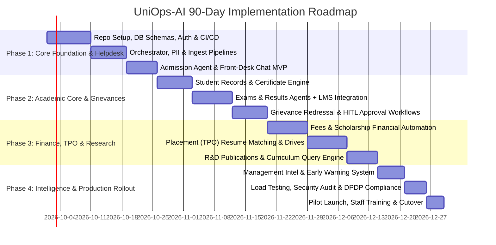

# University AI Operations Platform (UniOps-AI)
## Comprehensive Technical Project Requirements & 90-Day Implementation Plan

---

### Document Control & Metadata
- **Document Version:** 1.0.0
- **Author:** Senior AI Solutions Architect & Enterprise Systems Specialist
- **Target System:** University AI Operations Platform
- **Scope:** Multi-Agent Academic Operations, Student Lifecycle Management & Departmental Human-in-the-Loop Automation
- **Target Deployment Horizon:** 90 Days (Production-Ready Release)

---

## 1. Executive Summary & Strategic Vision

Modern higher-education institutions face significant operational friction across disconnected silos: Admissions, Registrar/Student Records, Finance & Accounts, Controller of Examinations, Training & Placement Cell (TPO), Grievance Redressal, and Research & Development (R&D).

The **University AI Operations Platform (UniOps-AI)** transforms university administration from fragmented manual ticketing and disparate portals into an **AI-orchestrated Higher Education Operating System**. Instead of a simplistic conversational bot, UniOps-AI implements an **Enterprise Multi-Agent System** where specialized domain agents collaborate under a centralized Semantic Orchestrator with strict **Human-in-the-Loop (HITL)** governance, role-based access control (RBAC), and deterministic guardrails.

```
                                    ┌────────────────────────────────────────────────────────┐
                                    │               UniOps-AI Gateway & Portal               │
                                    │       (Students / Parents / Faculty / Staff / Admins)  │
                                    └──────────────────────────┬─────────────────────────────┘
                                                               │
                                    ┌──────────────────────────▼─────────────────────────────┐
                                    │       Central Semantic Orchestrator & Intent Router     │
                                    │        (Intent, Entity, Sentiment, Risk Assessment)    │
                                    └──────────────┬───────────────────────────┬─────────────┘
                                                   │                           │
                   ┌───────────────────────────────┴───────────┐               │
                   ▼                                           ▼               ▼
    ┌─────────────────────────────┐             ┌─────────────────────────────┐ ┌─────────────────────────────┐
    │  Operational Domain Agents  │             │    Academic & Exam Agents   │ │ Placement & Research Agents │
    │ ├─ Admission Agent          │             │ ├─ Exam Schedule Agent      │ │ ├─ TPO Placement Agent      │
    │ ├─ Student Lifecycle Agent  │             │ ├─ Results & Grades Agent   │ │ ├─ R&D Publication Agent    │
    │ ├─ Fees & Finance Agent     │             │ ├─ Degree & Syllabus Agent  │ │ └─ Management Intel Agent   │
    │ └─ Grievance/Complaint Agent│             │ └─ Scholarship Agent        │ │                             │
    └──────────────┬──────────────┘             └──────────────┬──────────────┘ └──────────────┬──────────────┘
                   │                                           │                               │
                   └───────────────────────────┬───────────────┴───────────────────────────────┘
                                               │
                                    ┌──────────▼─────────────────────────────┐
                                    │       Policy & Guardrails Engine       │
                                    │  (FERPA/DPDP, PII Redaction, RBAC)     │
                                    └──────────┬─────────────────────────────┘
                                               │
                       ┌───────────────────────┴───────────────────────┐
                       ▼                                               ▼
        ┌─────────────────────────────┐                 ┌─────────────────────────────┐
        │  Human-in-the-Loop (HITL)   │                 │     Integration Layer       │
        │  Department Review Console  │                 │  (SIS, LMS, ERP, Vector DB) │
        └─────────────────────────────┘                 └─────────────────────────────┘
```

---

## 2. Enterprise System Architecture & Design Principles

### 2.1 Core Architectural Principles
1. **Deterministic Execution for Sensitive Data:** Financial balances, course grades, official transcripts, and disciplinary actions are never hallucinated or directly modified by autonomous agents without signed cryptographic audit logs and Human-in-the-Loop verification.
2. **Specialized Multi-Agent Specialization:** Rather than one monolithic LLM prompt, each departmental capability is handled by an isolated sub-agent equipped with domain-specific tools, schemas, knowledge bases, and escalation policies.
3. **Strict Zero-Trust Privacy & Compliance:** Compliant with India’s **DPDP Act (2023)** and international standards (**FERPA/GDPR**). Automated PII masking (Aadhaar, PAN, SSN, phone numbers, banking details) occurs at the Orchestrator ingest layer before passing to external inference providers.
4. **Context-Aware Hybrid Retrieval (RAG):** Multi-modal vector indexing (dense embeddings + sparse keyword BM25) over university bylaws, course syllabi, fee structures, scholarship criteria, and placement histories.

---

## 3. Departmental Role Charters & Governance Model

| Role / Department | Supervisory Agent | Primary Accountability | Manual Review / Escalation Triggers |
| :--- | :--- | :--- | :--- |
| **Chief of Admissions / Registrar** | Admission AI Agent | Lead conversion, eligibility verification, seat allotment, application verification SLAs | Disputed eligibility criteria, quota exceptions, fake/unverified document detection |
| **Dean of Student Affairs** | Student Lifecycle Agent | Profile management, bonafide/transfer certificates, ID card requests, student welfare | Name/DoB legal changes, duplicate enrollments, disciplinary holds |
| **Chief Finance Officer (CFO)** | Fees & Finance Agent | Fee collection schedules, concession processing, payment reconciliation, installment requests | Installment plans >2 tranches, fee waiver requests, disputed payment reconciliations |
| **Controller of Examinations (COE)** | Exam & Results Agents | Exam timetable collision resolution, hall ticket generation, marksheet publishing, revaluation | Grade change requests, exam malpractice flags, attendance threshold overrides (<75%) |
| **Grievance Redressal Committee** | Grievance / Complaints Agent | Student/faculty dispute categorization, priority detection, resolution SLA enforcement | Harassment / POSH allegations, ragging reports, faculty misconduct flags |
| **Head of Scholarship Cell** | Scholarship AI Agent | Merit/Need-based criteria mapping, government portal synchronization, grant disbursements | Quota allocation conflicts, income certificate discrepancies, renewal appeals |
| **Training & Placement Officer (TPO)** | Placement AI Agent | Corporate drive scheduling, JD parsing, candidate-job matching, offer letter management | Disputed minimum GPA exemptions, candidate no-show penalties, offer acceptance deadlines |
| **Dean of Research & Development** | Research & Publication Agent | Scopus/Web of Science indexing validation, conference grant tracking, patent logging | Plagiarism scan threshold violations (>10%), unapproved journal submissions |
| **Vice Chancellor / Provost** | Management Intelligence Agent | Cross-department KPI tracking, dropout early warning signals, financial forecasting | Institutional accreditation readiness (NAAC/NIRF), systemic operational anomalies |

---

## 4. Multi-Agent Catalog & Capability Specification

### 4.1 Master Orchestrator & Intent Router
- **Input:** Multi-turn text, voice transcriptions, document uploads.
- **Functions:**
  - Semantic Intent Routing (Zero-shot intent classification with >96% target accuracy).
  - Sentiment & Urgency Detection (Emergency / Distress detection triggers immediate routing to Counseling/Security).
  - Context & Session Memory Management (Redis-backed multi-turn state machine).
  - Enterprise PII Sanitization & Guardrails.

---

### 4.2 Agent 1: Admission & Enrollment Agent
- **Capabilities:**
  - Interactive course eligibility assessment based on prior academic qualifications.
  - Multi-lingual FAQ resolution (fee structures, hostel availability, quota reservations).
  - OCR-based document verification (10th/12th marksheets, identity proofs) with missing document alerts.
  - Step-by-step application form progression and fee link dispatch.
- **SLA & Benchmarks:** First response < 2 seconds; Document validation feedback < 10 seconds.

---

### 4.3 Agent 2: Student Lifecycle & Records Agent
- **Capabilities:**
  - Automated generation of digitally signed Bonafide Certificates and Proof of Enrollment.
  - Profile update workflows (address, guardian contacts, emergency information).
  - Student ID card re-issuance tracking and library clearance verification.
  - Term-wise course registration and elective selection advisory.
- **SLA & Benchmarks:** Bonafide PDF dispatch < 30 seconds.

---

### 4.4 Agent 3: Fees & Finance Agent
- **Capabilities:**
  - Accurate breakdown of outstanding semester fees, hostel fees, and laboratory deposits.
  - Dynamic payment link generation with webhook-based instant reconciliation.
  - Installment plan application submission and routing to Accounts Department.
  - Downloadable audited digital payment receipts and tax statement generation.
- **Guardrail:** Agent cannot waive fees or approve installment schemes without CFO electronic signature.

---

### 4.5 Agent 4: Examination & Seating Agent
- **Capabilities:**
  - Personalized exam schedule synthesis with classroom room-number and seat-allocation lookups.
  - Digital Hall Ticket eligibility verification (checks financial clearance and minimum 75% attendance).
  - Automated conflict and clash detection for backlogs and supplementary papers.
  - Real-time notification broadcast for exam room changes or schedule alterations.

---

### 4.6 Agent 5: Results & Academic Performance Agent
- **Capabilities:**
  - Granular semester marksheet and SGPA/CGPA calculation lookup.
  - Grade breakdown visualization (Continuous Internal Assessment vs. Mid-term vs. End-semester).
  - Workflow automation for Re-evaluation / Re-totalling requests and fee payment.
  - Supplementary exam eligibility notification and automated course remediation guides.

---

### 4.7 Agent 6: Grievance & Student Welfare Agent
- **Capabilities:**
  - Multi-tier categorization (Academic, Facility/Hostel, Finance, Harassment, Discrimination).
  - Priority scoring (P1: Critical/Emergency, P2: High Urgency, P3: Routine Operational).
  - Automated ticketing with cryptographic tracking hashes and escalation timer alerts.
  - Sentiment analysis detecting student distress with direct routing to psychological counseling.

---

### 4.8 Agent 7: Scholarship & Financial Aid Agent
- **Capabilities:**
  - Automated matching of student profiles against 50+ Institutional, Corporate, and State scholarships.
  - Income and merit certificate prerequisite validation.
  - Renewal milestone reminders and academic GPA maintenance tracking.
  - Direct inquiry integration with government scholarship portal APIs.

---

### 4.9 Agent 8: Degree Program & Curriculum Agent
- **Capabilities:**
  - Semantic syllabus search ("Which semester covers Distributed Systems and Raft Consensus?").
  - Credit audit engine computing graduation requirement fulfillment and open elective requirements.
  - Course prerequisite dependency graph traversal.

---

### 4.10 Agent 9: Training & Placement (TPO) Agent
- **Capabilities:**
  - Job Description (JD) parsing and semantic student resume scoring (0–100% skill match).
  - Automated shortlisting based on corporate criteria (CGPA cutoff, active backlogs, tech stack).
  - Interview scheduling, panel assignment, and calendar invite dispatch.
  - Offer letter receipt registration, package benchmarking, and placement analytics generation.

---

### 4.11 Agent 10: Research & Publication (R&D) Agent
- **Capabilities:**
  - DOI verification and automated indexing validation (Scopus, Web of Science, UGC-CARE).
  - Faculty/Student research metric dashboards (h-index, citation counts, journal impact factor).
  - Institutional grant and patent lifecycle tracking.
  - Plagiarism compliance checklist verification before institutional review board (IRB) submission.

---

### 4.12 Agent 11: Management Intelligence & Analytics Agent
- **Capabilities:**
  - Real-time Executive Summaries for Chancellor/VC/Registrar.
  - Cross-departmental KPI dashboards (fee collection efficiency, placement rates, dropout risks).
  - Predictive At-Risk Student Early Warning System (attendance drops + failing internals).
  - Automated NIRF/NAAC accreditation compliance data aggregation.

---

## 5. Technical Stack & System Architecture

```
┌────────────────────────────────────────────────────────────────────────┐
│                          PRESENTATION LAYER                            │
│  - Angular 18+ / TailwindCSS Enterprise Design System                 │
│  - WebSocket Real-Time Token Streaming & Notification Hub             │
│  - Role-Based Portals: Student, Faculty, Staff, Executive Dashboard    │
└───────────────────────────────────┬────────────────────────────────────┘
                                    │ HTTP / WebSocket (TLS 1.3)
┌───────────────────────────────────▼────────────────────────────────────┐
│                           API GATEWAY LAYER                            │
│  - FastAPI (Python 3.11+) Asynchronous Micro-framework                │
│  - OAuth2.0 / JWT Auth / SAML 2.0 University SSO Integration           │
│  - Redis Token Bucket Rate Limiting & Distributed Session Caching      │
└───────────────────────────────────┬────────────────────────────────────┘
                                    │
┌───────────────────────────────────▼────────────────────────────────────┐
│                    AGENTIC ORCHESTRATION & INFERENCE                   │
│  - Orchestrator Engine (LangGraph / StateGraph Multi-Agent Workflows)  │
│  - LLM Inference: Hybrid Tier (Primary: OpenAI GPT-4o / Claude 3.5;    │
│    Self-Hosted: Ollama Llama 3.3 70B for On-Prem Sensitive Data)       │
│  - Guardrails Layer (NeMo Guardrails + Presidio PII Masking)          │
└──────────────────┬─────────────────────────────────┬───────────────────┘
                   │                                 │
┌──────────────────▼────────────────┐ ┌──────────────▼──────────────────┐
│          STORAGE LAYER            │ │       INTEGRATION CONNECTORS    │
│  - PostgreSQL 16 (Relational DB)  │ │  - University SIS / ERP APIs    │
│  - Qdrant / PgVector (Vector DB)  │ │  - Canvas / Moodle LMS (LTI API)│
│  - Redis 7.2 (Queue & Caching)    │ │  - Payment Gateway (Razorpay/St)│
│  - MinIO / AWS S3 (Doc Storage)   │ │  - SMTP / WhatsApp Business API │
└───────────────────────────────────┘ └─────────────────────────────────┘
```

---

## 6. The 90-Day Implementation Plan (Sprint Breakdown)

The 90-day implementation is structured into **Four High-Velocity Phases** with bi-weekly sprint deliverables, automated regression testing, and departmental user acceptance testing (UAT).



---

### **PHASE 1: Foundation, Semantic Orchestrator & Front-Door Helpdesk (Days 1–25)**

#### **Milestone Objective:**
Deploy core microservice architecture, authenticate against mock/live SIS, stand up vector database, build Central Semantic Orchestrator, and release the public-facing **Admission & Student Helpdesk AI Agent**.

#### **Detailed Sprint Breakdown:**
- **Sprint 1.1 (Days 1–10): Platform Scaffolding, Data Models & Security Framework**
  - Initialize production monorepo (`backend/`, `frontend/`, `deploy/`).
  - Establish PostgreSQL relational schemas (Users, Roles, AuditLogs, DepartmentQueues, Tickets).
  - Implement JWT authentication with Role-Based Access Control (`STUDENT`, `PARENT`, `FACULTY`, `HOD`, `DEAN`, `REGISTRAR`, `ADMIN`).
  - Configure Vector DB (Qdrant/PgVector) with hybrid semantic indexing (chunking strategy: hierarchical 512 tokens with 10% overlap).
  - Setup CI/CD automated linting, type-checking, and containerized build pipelines.

- **Sprint 1.2 (Days 11–18): Master Semantic Orchestrator & Guardrail Pipeline**
  - Construct the Orchestrator StateGraph with multi-intent classification and fallback handling.
  - Implement PII anonymization layer using Presidio / Regex filters for student personal identifying data.
  - Establish prompt playbook management with dynamic context injection from RAG pipelines.
  - Configure Redis distributed caching for user session conversational states.

- **Sprint 1.3 (Days 19–25): Admission Agent v1.0 & Unified Web Chat UI**
  - Implement Admission Agent: Program catalog Q&A, eligibility evaluator, fee calculator.
  - Integrate document upload with automated OCR verification for high school certificates.
  - Build Angular frontend: Standalone components, real-time WebSocket chat streaming, mobile-responsive layout.
  - Conduct Unit & Integration testing (Target: 90%+ routing accuracy on 100 test queries).

#### **Phase 1 Deliverables:**
- [x] Functional web portal with streaming AI chat.
- [x] Orchestrator capable of distinguishing Admissions vs. General Campus Queries.
- [x] Ingested University Prospectus and Program Bylaws in Vector DB.
- [x] 80%+ automated resolution rate for admission inquiries in staging.

---

### **PHASE 2: Academic Core, Examinations & Grievance Workflows (Days 26–50)**

#### **Milestone Objective:**
Deliver Student Records, Examination Schedules, Results Dissemination, and the Multi-Tier Grievance Redressal system with interactive Human-in-the-Loop staff review consoles.

#### **Detailed Sprint Breakdown:**
- **Sprint 2.1 (Days 26–33): Student Lifecycle & Digital Records Service**
  - Build Student Records Agent: Profile verification, enrollment history, attendance summaries.
  - Implement Automated Certificate Engine: PDF generation for Bonafide, Transfer, and Medium-of-Instruction certificates with QR code verification.
  - Integrate role-based student dashboard showing personalized academic status.

- **Sprint 2.2 (Days 34–42): Controller of Examinations (COE) & Results Pipeline**
  - Develop Exam Agent: Timetable lookup, hall ticket eligibility check, seating arrangement query.
  - Develop Results Agent: Semester grades breakdown, CGPA trajectory calculator, backlog advisor.
  - Implement Revaluation Request Workflow: Automated ticket creation, fee attachment, and Exam Cell notifications.
  - Mock/Live integration with university LMS (Canvas/Moodle) and SIS grade tables.

- **Sprint 2.3 (Days 43–50): Grievance Classifier & Staff HITL Approval Console**
  - Construct Grievance Redressal Agent with priority classification (Emergency, Academic, Administrative, Harassment).
  - Build Departmental Staff Review UI: HOD/Dean inbox for pending approvals, one-click ticket resolution, audit notes.
  - Automated escalation triggers for tickets approaching SLA breach (>48h unacknowledged).

#### **Phase 2 Deliverables:**
- [x] Student self-service certificate generation (<30 sec delivery).
- [x] Automated exam timetable & results query system with 95% accuracy.
- [x] Fully functioning Grievance Redressal workflow with departmental approval queues.
- [x] Comprehensive audit trail logging every AI and human action.

---

### **PHASE 3: Financial Operations, Placements & Research Intelligence (Days 51–75)**

#### **Milestone Objective:**
Automate fee tracking, scholarship discovery, campus recruitment matchmaking, curriculum credit audits, and R&D research publication tracking.

#### **Detailed Sprint Breakdown:**
- **Sprint 3.1 (Days 51–59): Fees & Finance Engine + Scholarship Matrix**
  - Develop Fees Agent: Due-date tracking, fine calculation, receipt generation, installment request pipeline.
  - Integrate Payment Gateway webhook triggers for immediate ledger balance updates.
  - Develop Scholarship Agent: 50+ scheme eligibility evaluator, documentation checklist guide, renewal tracker.

- **Sprint 3.2 (Days 60–68): Corporate Placement (TPO) Ecosystem**
  - Develop Placement Agent: Drive announcements, eligibility screening, PDF resume skill extraction.
  - Implement Job-Student Matching Algorithm: Semantic matching of student skills vs. corporate JDs.
  - Automated interview scheduling and slot booking with calendar invites.
  - Offer letter intake, CTC verification, and corporate placement analytics generator.

- **Sprint 3.3 (Days 69–75): Curriculum Auditing & Research Publications (R&D)**
  - Develop Degree Program Agent: Elective selection assistance, credit audit calculator, prerequisite dependency checks.
  - Develop Research & Publication Agent: DOI API integration (Crossref/Scopus), publication citation tracker, patent and grant registry.

#### **Phase 3 Deliverables:**
- [x] Automated fee balance and receipt retrieval with 0% calculation discrepancies.
- [x] Placement matching engine reducing TPO manual screening time by 60%.
- [x] Complete scholarship eligibility mapping engine.
- [x] R&D publication and citation tracking portal.

---

### **PHASE 4: Management Intelligence, Enterprise Hardening & Campus Rollout (Days 76–90)**

#### **Milestone Objective:**
Implement Executive Business Intelligence, execute stress and load testing, enforce cybersecurity and DPDP compliance audits, conduct university-wide training, and complete production rollout.

#### **Detailed Sprint Breakdown:**
- **Sprint 4.1 (Days 76–81): Management Dashboard & Early Warning Intelligence**
  - Develop Management Intelligence Agent: Natural language executive queries ("Show me fee default trends across School of Engineering").
  - Implement Predictive At-Risk Student Warning Model (flags students with low attendance + poor continuous assessment marks).
  - Executive KPI dashboards: Admissions funnel, placement conversion, NAAC/NIRF metric summaries.

- **Sprint 4.2 (Days 82–86): Enterprise Hardening, Security Audit & Load Testing**
  - Conduct Penetration Testing & Vulnerability Assessment (OWASP Top 10 for LLM Applications).
  - Validate DPDP Act / FERPA compliance: Right-to-be-forgotten endpoints, consent logs, PII redaction audit.
  - Load and stress testing: Simulate 5,000 concurrent WebSocket sessions and 500 requests/sec API throughput (Target: p99 latency < 2.5s).
  - Implement automated fallback protocols: Graceful degradation to human staff ticketing if LLM API rate limits are exceeded.

- **Sprint 4.3 (Days 87–90): Production Cutover, Staff Training & Pilot Launch**
  - Final database migration and production DNS cutover with SSL/TLS 1.3 certificates.
  - Conduct hands-on training workshops for Admissions, Academics, Finance, and TPO staff.
  - Pilot rollout to 2 academic departments (e.g., School of Computer Science & School of Management).
  - Institutional launch sign-off and 24/7 hypercare monitoring activation.

#### **Phase 4 Deliverables:**
- [x] Production system live with 11 domain agents.
- [x] Executive Management BI dashboards fully active.
- [x] Security audit sign-off and penetration test remediation reports.
- [x] Complete administrator, developer, and user documentation published.

---

## 7. Non-Negotiable Guardrails, Governance & Security Matrix

```
┌───────────────────────────────┬──────────────────────────────────────────────────────────────────┐
│ Governance Domain             │ Enforced Mechanism & Implementation Policy                       │
├───────────────────────────────┼──────────────────────────────────────────────────────────────────┤
│ Zero Financial Hallucination  │ AI is restricted to READ-ONLY queries on fee ledgers. Fee waiver │
│                               │ or installment approval requires CFO cryptographic sign-off.     │
├───────────────────────────────┼──────────────────────────────────────────────────────────────────┤
│ Grade & Result Integrity      │ Official grades are pulled from read-only replica databases. Any │
│                               │ revaluation or grade dispute generates an unmodifiable ticket.   │
├───────────────────────────────┼──────────────────────────────────────────────────────────────────┤
│ Privacy & PII Protection      │ Presidio anonymizer strips student identification numbers, phone  │
│                               │ numbers, and financial details before prompt assembly.           │
├───────────────────────────────┼──────────────────────────────────────────────────────────────────┤
│ Auditability & Provenance     │ Every LLM response is logged with Prompt Version, RAG source doc │
│                               │ chunks, confidence score, and routing trajectory hash.          │
├───────────────────────────────┼──────────────────────────────────────────────────────────────────┤
│ Emergency Escalations         │ Suicide, distress, harassment, or ragging flags trigger bypass   │
│                               │ protocol: immediate SMS/Email alert to Proctor & Counseling Head.│
└───────────────────────────────┴──────────────────────────────────────────────────────────────────┘
```

---

## 8. Success Metrics & Key Performance Indicators (90-Day SLA Targets)

| Key Performance Indicator (KPI) | Baseline (Manual) | 90-Day Target (UniOps-AI) | Department Owner |
| :--- | :--- | :--- | :--- |
| **Admission Enquiry Response Time** | 24–48 Hours | **< 5 Seconds (Instant)** | Chief of Admissions |
| **Admission Query Automation Rate** | 0% | **85%+ Autonomous** | Chief of Admissions |
| **Bonafide Certificate Turnaround** | 3–5 Working Days | **< 1 Minute (Automated)** | Registrar / Student Affairs |
| **Exam & Result Query Resolution** | 4–8 Hours Queue | **< 3 Seconds (Instant)** | Controller of Examinations |
| **Grievance First-Response SLA** | 3–7 Days | **< 10 Minutes (Classified)** | Grievance Committee |
| **TPO Placement Candidate Screening** | 5 Days / Company Drive| **< 2 Hours (Automated)** | Training & Placement Officer |
| **Financial Ledger Reconciliation** | Manual End-of-Day | **Real-Time Automated** | Chief Finance Officer |
| **System High Availability** | N/A | **99.9% Uptime** | DevOps & Cloud Lead |
| **User Satisfaction Score (CSAT)** | ~55% | **> 90% Positive Feedback**| Vice Chancellor / Registrar |

---

## 9. Risk Management & Mitigation Framework

```
┌─────────────────────────────────┬──────────┬─────────────────────────────────────────────────────┐
│ Risk Factor                     │ Severity │ Mitigation Strategy                                 │
├─────────────────────────────────┼──────────┼─────────────────────────────────────────────────────┤
│ LLM Hallucination on Policies   │ HIGH     │ Strict Top-P RAG grounding with citation requirement;│
│                                 │          │ fallback to human if similarity score < 0.78.       │
├─────────────────────────────────┼──────────┼─────────────────────────────────────────────────────┤
│ Third-Party API Outages (OpenAI)│ MEDIUM   │ Multi-provider fallback (OpenAI -> Anthropic ->     │
│                                 │          │ Local Self-Hosted Ollama Llama 3.3).                │
├─────────────────────────────────┼──────────┼─────────────────────────────────────────────────────┤
│ User Adoption & Resistance      │ MEDIUM   │ Department-specific workshops, intuitive UI with     │
│                                 │          │ human-override buttons on every screen.             │
├─────────────────────────────────┼──────────┼─────────────────────────────────────────────────────┤
│ Data Breach / PII Leakage       │ CRITICAL │ Strict column-level encryption, role-based JWT auth, │
│                                 │          │ stateless LLM processing, zero data retention flag. │
└─────────────────────────────────┴──────────┴─────────────────────────────────────────────────────┘
```

---

## 10. Summary & Next Steps

This document serves as the formal **System Requirements Specification (SRS) and Master Implementation Blueprint** for the University AI Operations Platform. Execution begins immediately following Phase 1, Milestone 1 sprint schedules.
